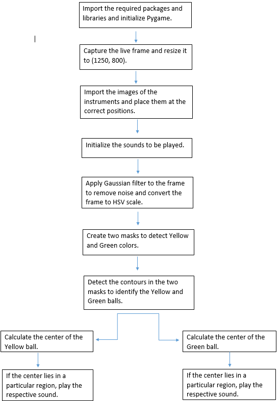

# Air Drums
This project was done during the months of february and march in 2018.

### Description

This project involves creating a virtual drum system that can be played using a webcam and a computer system alone and the program I created tracks two drumsticks, with Yellow and Green colored ball attached to the drumsticks, through live webcam video and plays sounds based on simulated air-drumming “hits”.

### Software Requirements

  - **Python** - A general-purpose interpreted, interactive, object-oriented, and high level programming language.
  - **OpenCV**: OpenCV (Open Source Computer Vision Library) is an open source computer vision and machine learning software library. It is released under a BSD license and hence it’s free for both and academic and commercial use. OpenCV was designed computational efficiency and with a strong focus on real-time applications.
  - **Numpy**: NumPy is a library for the Python programming language, adding support for large, multidimensional arrays and matrices, along with a large collection of high level mathematical functions to operate on these arrays.
  - **Pygame**: Pygame (the library) is a Free and Open Source Python programming language library for making multimedia applications like games, music built on top of the excellent SDL library.

### Software Design

 - **Importing and initializing**:  All the required libraries and packages such as OpenCV, numpy and pygame are imported.
Pictures of different parts of a drum set are imported, resized using *cv2.resize()* and are placed at appropriate positions on the frame.
All the different sounds corresponding to each instrument of the drum set were imported and initialized using *pygame.mixer.Sound()*.

- **Frame Reading and processing**: The camera frame was got using *cv2.VideoCapture()*. It was then converted to HSV color model. 
HSV is one of the two most common representations of points in an RGB color model. 
H means hue, while S means saturation, and V means value.

- **Ball detection**: *cv2.FindContours()* function is used to obtain the contours from the thresholder image. The system then proceeds to identify which contours to track.
This function is used to detect the Yellow and the Green balls and its respective centers were found using *cv2.moments()*. 

- **Ball Tracking and production of sound**: The centers of the colored balls are tracked.
If the center lies in the region above the image of an instrument, then the corresponding sound of that instrument is produced using the function *pygame.mixer.Sound.play()*.

### Flowchart

### License
[MIT](https://choosealicense.com/licenses/mit/)